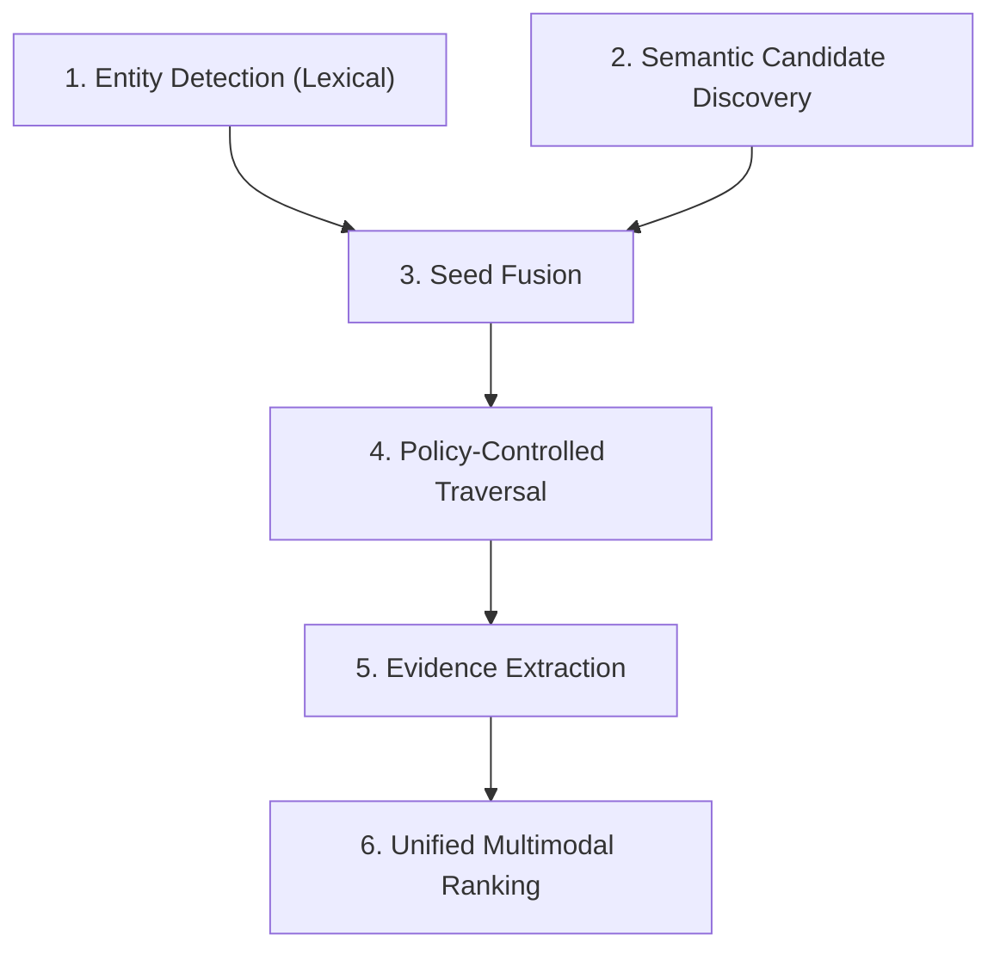

# Graphyra Retrieval Architecture (V1.3 Frozen)

This document provides a static reference architecture of the Graphyra retrieval engine pipeline. The system is designed to perform high-quality context retrieval by leveraging a heterogeneous knowledge graph (Entity ↔ Chunk ↔ Entity) combined with dense vector semantic search.

---

## The 6 Stages of the Retrieval Pipeline

The entire retrieval lifecycle is processed sequentially through 6 core stages:

---

### Stage 1: Entity Detection (Lexical)
* **Objective:** Identify explicit entity mentions in the natural language query.
* **Mechanism:** Scans the query text for exact case-insensitive matches of entity canonical names and all registered aliases.
* **Output:** A set of detected entity node IDs.

---

### Stage 2: Semantic Candidate Discovery
* **Objective:** Find concepts and context that are semantically similar to the query but might not match lexically.
* **Mechanism:** 
  1. Generates a dense query vector embedding via the configured `EmbeddingProvider`.
  2. Queries the Vector Index to retrieve the top $K$ semantically similar chunks.
  3. Extract all entity mentions within these chunks using a vocabulary-aware Mention Extractor.
* **Output:** A set of semantically matching entity node IDs with associated similarities.

---

### Stage 3: Seed Fusion
* **Objective:** Merge lexical and semantic entities into a prioritized list of seed traversal anchors.
* **Mechanism:** Integrates both anchor lists and applies a fusion scoring strategy (e.g., lexical dominance with semantic fallback scoring) to produce a unified, sorted set of seed entities.
* **Output:** Sorted seed entity IDs.

---

### Stage 4: Policy-Controlled Traversal
* **Objective:** Explore the heterogeneous graph (Entity → Chunk → Entity) starting from the seed anchors without frontier explosion.
* **Mechanism:**
  * Uses a modular **`ExpansionPolicy`** to select which adjacent edges/nodes to traverse.
  * Employs BFS queue tracking that caps visited entities (`entity_budget`) and visited chunks (`chunk_budget`) independently.
  * Explores up to `max_depth = 3` to allow navigating to neighboring entities.
  * **Memory Optimization:** Graph adjacency maps and node types are warmed up in-memory at startup, ensuring **0 SQL query overhead** during BFS traversal.
* **Output:** A `TraversalResult` containing visited nodes, unique traversed relations, and scored traversal paths.

---

### Stage 5: Evidence Extraction
* **Objective:** Extract and bound the candidate chunk pool based on traversed nodes.
* **Mechanism:** Extracts all chunk nodes explicitly visited by the traversal engine, bounding the candidate pool strictly to the traversed chunks to maintain relevance.
* **Output:** Bounded list of `CandidateEvidence` objects.

---

### Stage 6: Unified Multimodal Ranking
* **Objective:** Produce the final top-$N$ context chunks to feed the reasoning engine.
* **Mechanism:**
  1. Computes structural traversal relevance scores.
  2. Computes lexical relevance scores (e.g. BM25).
  3. Computes semantic relevance scores.
  4. Normalizes all scores and aggregates them using a unified strategy (e.g. `GraphCentricStrategy`).
  5. Slices and returns the top $N$ (default 20) chunks.
* **Output:** final selected context chunks.
