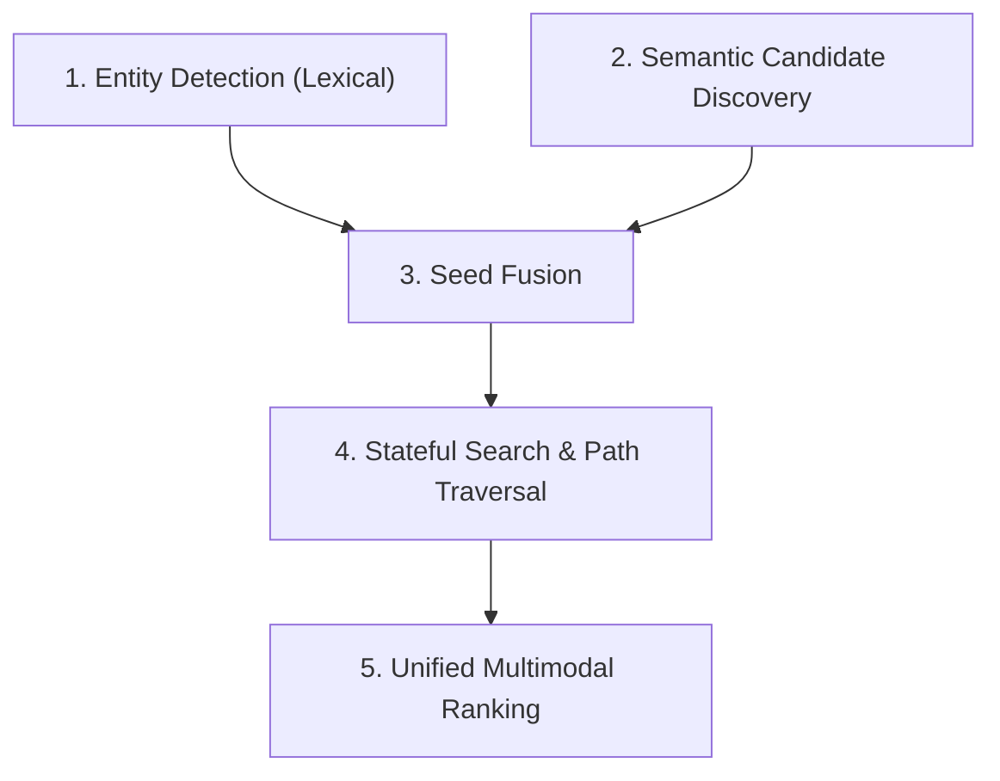

# Graphyra Retrieval Architecture (V1.3 Stateful)

This document provides a static reference architecture of the Graphyra retrieval engine pipeline. The system is designed to perform high-quality context retrieval by leveraging a heterogeneous knowledge graph (Entity ↔ Chunk ↔ Entity) combined with dense vector semantic search.

---

## The 5 Stages of the Retrieval Pipeline

The entire retrieval lifecycle is processed sequentially through 5 core stages:

---

### Stage 1: Entity Detection (Lexical)
* **Objective:** Identify explicit entity mentions in the natural language query.
* **Mechanism:** Scans the query text for exact case-insensitive matches of entity canonical names and all registered aliases.
* **Output:** A set of detected entity node IDs.

---

### Stage 2: Semantic Candidate Discovery
* **Objective:** Find concepts and context that are semantically similar to the query but might not match lexically.
* **Mechanism:** 
  1. Generates a dense query vector embedding via the configured `EmbeddingProvider`.
  2. Queries the Vector Index to retrieve the top $K$ semantically similar chunks.
  3. Extracts all entity mentions within these chunks using a vocabulary-aware Mention Extractor.
* **Output:** A set of semantically matching entity node IDs with associated similarities.

---

### Stage 3: Seed Fusion
* **Objective:** Merge lexical and semantic entities into a prioritized list of seed traversal anchors.
* **Mechanism:** Integrates both anchor lists and applies a fusion scoring strategy (e.g., lexical dominance with semantic fallback scoring) to produce a unified, sorted set of seed entities.
* **Output:** Sorted seed entity IDs.

---

### Stage 4: Stateful Search & Path Traversal
* **Objective:** Explore the heterogeneous graph (Entity → Chunk → Entity) starting from the seed anchors, selecting relevant evidence, and spawning path successor states.
* **Mechanism:**
  * Uses a priority queue (Frontier heap) to manage search branches (`SearchState`).
  * For each popped state, it generates neighbor candidates and evaluates their chunks globally.
  * Computes a global **Expansion Context Baseline (ECB)** over the candidate chunks to dynamically filter out noise chunks.
  * Chunks passing the threshold (`MRV - ECB > acceptance_margin`) are accepted as evidence, and their associated entities are queued as successor states on the Frontier.
  * Employs strict budget boundaries (`entity_budget`, `chunk_budget`) to terminate early upon evidence saturation.
* **Output:** A stateful `RetrievalResult` DTO mapping final accepted evidence chunks, traversed path trees, diagnostics, and metrics.

---

### Stage 5: Unified Multimodal Ranking
* **Objective:** Produce the final top-$N$ context chunks to feed the reasoning engine.
* **Mechanism:**
  1. Computes structural traversal relevance scores.
  2. Computes lexical relevance scores (e.g. BM25).
  3. Computes semantic relevance scores.
  4. Normalizes all scores and aggregates them using a unified strategy (e.g. `GraphCentricStrategy`).
  5. Slices and returns the top $N$ (default 20) chunks.
* **Output:** final selected context chunks.
