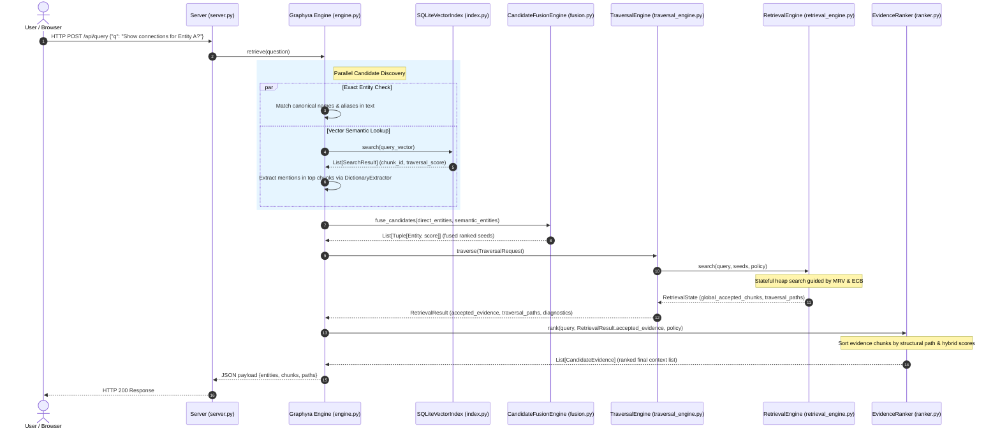

# Graphyra — System Architecture & Topology

This document describes the high-level system topology, data boundaries, and query execution life cycle of Graphyra V1.

---

## 1. Architectural Boundaries

Graphyra separates the ingestion of raw, external source content from the representation of entities and relations. The system is split into two principal parts:

1. **External Source Adapter** (`graphyra-adapter-genshin`): Scrapes external sites (e.g. Genshin Fandom Wiki), parses raw HTML DOM tables and paragraphs, and constructs standard `KnowledgeDocument` containers.
2. **Graphyra Core** (`Graphyra`): Receives the standard `KnowledgeDocument`, performs paragraph segmentation, extracts entity mentions, maps synonym aliases, creates graph relations, indexes vector semantics, and resolves traversals.

```text
External Source (Wiki)
        │
        ▼
[graphyra-adapter-genshin]  <--- Scraping & parsing boundaries
        │
        │  Produce KnowledgeDocument
        ▼
KnowledgeDocument           <--- Interface boundary
        │
        ▼
[Graphyra Core]             <--- Graph & Traversal boundaries
   ├── Artifact Creation
   ├── Paragraph-First Chunking
   ├── Mention Extraction
   ├── Alias / Anchor Resolution
   ├── Relation / Link Construction
   └── Traversal & Stateful Semantic Retrieval
```

---

## 2. Core System Topology

Graphyra operates on two distinct databases to keep knowledge graphs isolated from machine learning derivations:
1. **Knowledge Graph DB** (`graphyra.db`): The relational truth store containing pages (artifacts), text chunks, entities (anchors), synonym aliases, entity mentions, and structural links.
2. **Semantic Vector Index** (`embeddings.db`): A decoupled vector index storage mapping chunk IDs to floating-point embedding arrays. It acts as an auxiliary candidate discovery layer.

```text
               +--------------------------------------+
               |          Client Visualizer           |
               +------------------+-------------------+
                                  |
                                  | HTTP REST API
                                  v
               +------------------+-------------------+
               |        web server (server.py)        |
               +--------+--------------------+--------+
                         |                    |
                         | Query              | Crawl & Sync Job
                         v                    v
               +--------+---------+  +-------+--------+
               |  Graphyra Engine |  | Ingestion      |
               |    (engine.py)   |  | Pipeline       |
               +---+-----------+--+  +-------+--------+
                    |           |             |
                    |           |             | Incremental Sync
                    |           v             v
                    |     +-----+-------------+----+
                    |     |    EmbeddingIndexer    |
                    |     +-----------+------------+
                    |                 |
                    v                 v
           +--------+--------+  +-----+------------+
           | Knowledge Graph |  |  SQLiteVector    |
           |       DB        |  |     Index        |
           |  (graphyra.db)  |  | (embeddings.db)  |
           +-----------------+  +------------------+
```

---

## 3. Query Sequence Flow

When a query is received at `/api/query`, it triggers parallel candidate discovery, DTO fusion, graph traversal, and subgraph formatting.



---

## 4. Design Assumptions & Suitability Profile

Graphyra is intentionally optimized for reference-rich, interconnected corpora rather than flat collections of disjointed documents. 

### Core Assumptions:
* **Explicit or Derivable Relations**: The retrieval engine assumes the presence of navigable connections (e.g., wiki hyperlinks, legal/statutory cross-references, academic citations, database relationships, code imports, or cell ontologies).
* **Entity-Centric Traversal**: It assumes that navigating from entity anchor to entity anchor along relationships leads directly to the most promising supporting evidence.

### Corpus Selection Matrix:

| Suitability Class | Examples | Architectural Advantage |
| :--- | :--- | :--- |
| **Highly Suitable** | Wikis, API Reference Docs, Software Imports, Research Papers, Regulatory Statutes | **Maximal**: Stateful path traversals resolve multi-hop links and explain evidence provenance step-by-step. |
| **Less Suitable** | Random Chat Logs, Blog Feeds, News Snippets, Disjointed PDF catalogs | **Minimal**: Falls back to isolated keyword/semantic matches without relational benefit. |
